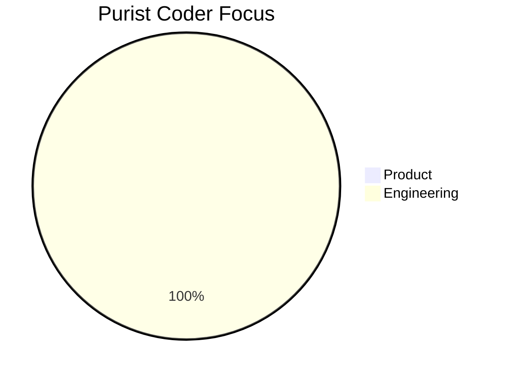
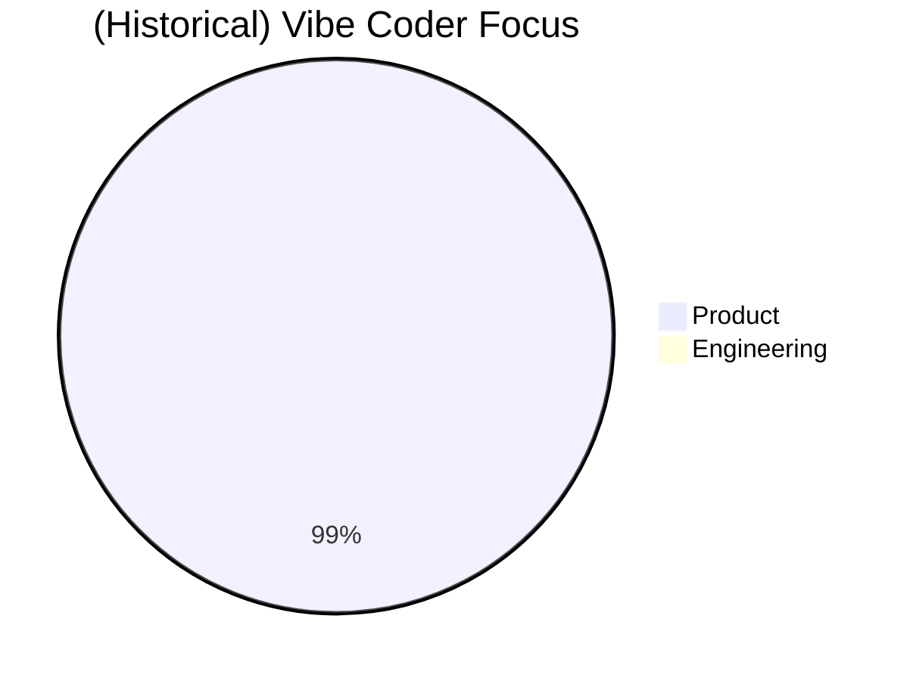
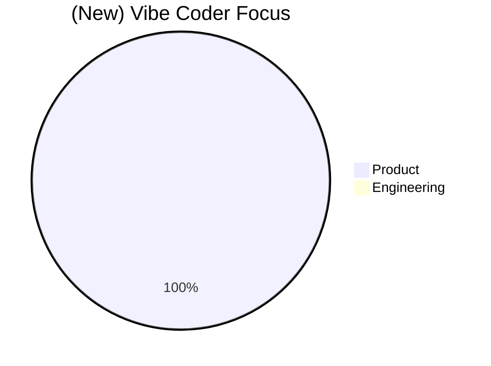
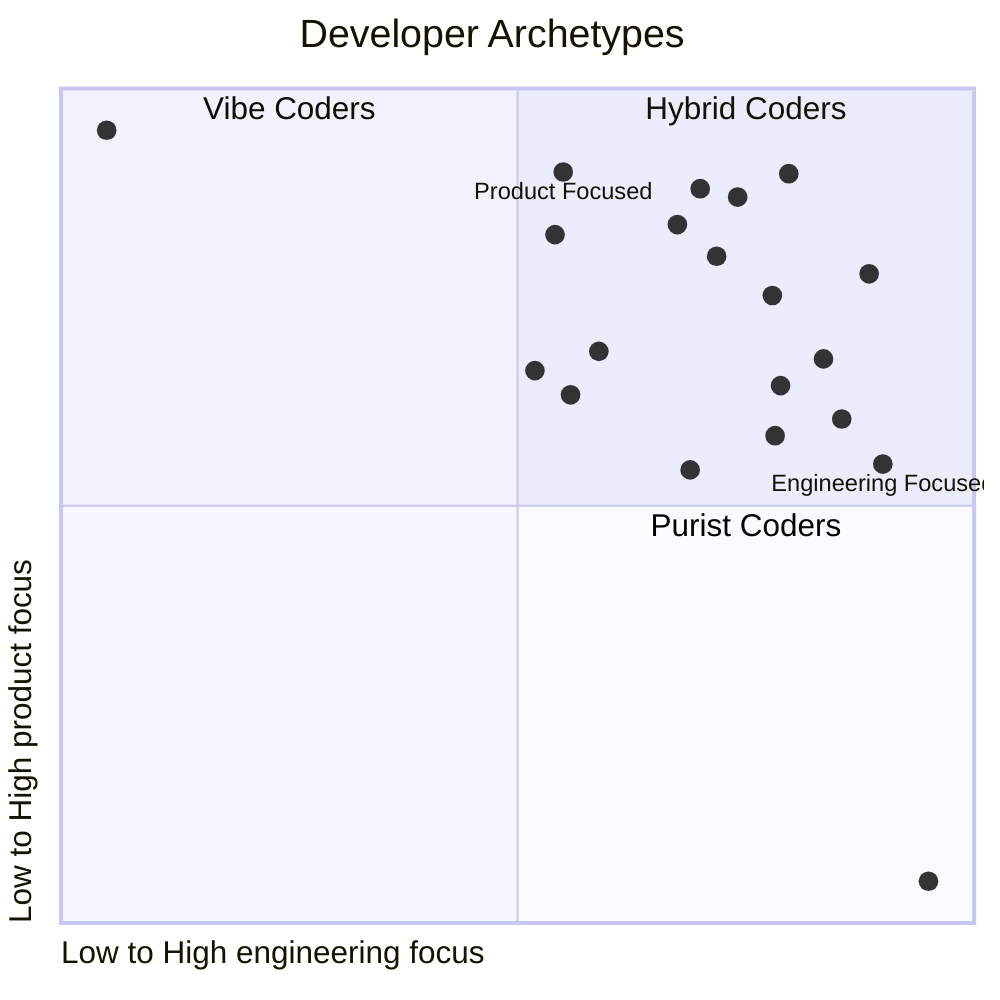

> Navigating extremes in the age of AI-assisted development — and why balance matters more than ever.
<!--more-->

 

## 🌀 Understanding "Vibe Coding"

The term "vibe coding" has recently entered the tech lexicon, describing developers who only care about the product's features, treating the tech as an obstacle to progress. This concept isn't novel; it's a modern label for an age-old approach.

I've worked with this kind of developer many times, you probably have too. They're fantastic at demo day: they've pushed out six new features, redesigned the flow, and added some integrations. It looks great - but behind the scenes, the system is primed to fail: fragile implementation, poor optimisation, no tests, no ownership, and a codebase that's already too tangled to evolve. It functions just long enough to impress - then begins to collapse under the weight of real-world use.

They leave behind a trail of hacks and duct-taped logic that their team has to clean up. While they take credit for shipping fast, it's their teammates who inherit the mess. Outwardly, they shine - internally, the team, product, and company suffer under the weight of fragile foundations and rushed implementation.

## 🧱 On the Other Side: "Purist Coding"

The opposite has always existed, let's name it: **Purist Coding**. These developers only care about the elegance and technicalities of the code  -  the product itself is incidental. You've likely met someone who practices it. They'll spend a month choosing between two nearly identical technologies, and a week grooming a small amount of code to their perception of perfection.

Their work is elegant and principled, sure - but it takes *forever* to ship. Not because they lack capability, but because the idea of imperfection is intolerable. Purist Coding often results in beautiful, pristine castles - places of architectural wonder - that no one ever moves into.

These devs don't go around creating problems for their teammates - there's no mess to clean up - but they do make painfully slow progress toward the actual goal: delivering a product. Their time is spent polishing abstractions, theorising over edge cases, and refactoring code that no user will ever see. Meanwhile, the product remains just out of reach, and opportunities quietly pass them by.

## 🔄 What Changed

Historically, vibe coders had to understand at least some software engineering - otherwise, they simply couldn't do the job. But with the advent of LLMs, that constraint has evaporated.

This shift has created the final form of the vibe coder: someone who operates entirely at the product level, with no grasp - or even concern - for how the thing gets built. They're now able to work without concern for structure, testing, or performance. Where the purist obsesses over every detail before shipping anything, the modern vibe coder ships everything without understanding any of the details.

And it comes with consequences.

## ⚠️ The Cost of Extremes

Both vibe coding and purist coding can be deeply destructive when left unchecked.

Teams anchored too far in vibe coding risk chaos: brittle systems, impossible scaling, and burnout from constantly fighting fires. Over time, the mountain of tech debt grows so large that even small changes become risky and expensive. Eventually, teams lose the ability to move fast - and competitors who can ship cleanly and consistently will win. It's a short-term high that often leads to long-term pain.

On the other end, purist coding is excruciatingly slow. It's not that development stalls completely - it's that a large amount of work is wasted on hypothetical scenarios that never happen. The product takes so long to reach the market that it can miss its window entirely, never gaining traction or user feedback. Users don't benefit from theoretical perfection - they benefit from working software.

## 🧘‍♀️ Finding Balance

Somewhere between these two extremes are the developers who balance progress and perfection. Their features are built with care and purpose, and they ship within a timeframe that keeps the momentum going. Let's talk about two more examples:

- **🛠️ The Product-Focused Coder** centres their work around delivering user-facing value. They keep product goals in sharp focus and build with intention. They don't cause chaos or leave messes for others to clean up - because they also care about the engineering side. They're constantly asking, "What will the user experience?" and then ensuring that experience is backed by a solid, dependable foundation.  They build with a clear path to iteration and scaling - enough structure to support growth, without overengineering.

- **🔧 The Engineering-Focused Coder** approaches development with scalability, maintainability, and reliability in mind. They understand that a bug or an outage can erode user trust just as much as a bad feature. For them, clean engineering is not an abstract pursuit - it's a way to ensure smooth launches, provide a reliable user experience, and protect the company's reputation. They care deeply about feature releases too - knowing that timely delivery is as crucial to users as stability.

These are the kinds of coders every team needs. People who focus on the effect their work has on the end user, who might approach things from different angles, but share a common outcome: they deliver with balance. They don't obsess over one side of the spectrum - they understand and respect both.

## 🤖 The AI Shift

So why has "vibe coding" become such a big deal recently? In its previous form, it still required a baseline level of development competence - you couldn't ship a feature without at least some coding skill. But now we have AI churning out code on request, and people with zero understanding of software development are prompting AI that also have no true understanding. LLMs are, after all, just predicting the next statistically most likely token - not designing solutions.

The wall has been knocked down. What once held back the ultimate form of vibe coding - implementation - has vanished. But the risks haven't. We're now seeing code that appears to work today and silently breaks tomorrow.

Maintainability is gone. Reliability is gone. Scalability is gone. But because everything *appears* to work - at least during the demo - non-technical stakeholders are rushing headlong toward this new development model. They're making bold bets, building out entire products and platforms on brittle, AI-generated foundations that can't be trusted to hold up. The danger isn't just in the code - it's in the illusion of progress.

## 🧯 What Next

This runaway adoption of vibe coding is building up to an inevitable crash. At some point, the shortcuts will catch up. Systems will fail at scale. Teams will either burn out trying to hold them together, or lack the skills to address the problems they introduced. Entire products will collapse under their own architectural negligence.

And when that moment comes, companies will need hybrid coders - the ones who can make sense of the chaos, untangle the mess, and rebuild with both product impact and technical depth. But here's the problem: those developers are being side-lined right now. They're losing jobs to vibe coders who seem faster. They're underappreciated because their value isn't flashy. Many are leaving the industry, switching careers, or simply burning out.

We're not just losing time. We're losing experience, judgment, and balance - the very things we'll desperately need to fix what's coming.

## 🧠 AI Isn't the Only Problem Here

It's important to be clear: LLMs aren't the root of the issue. When used well, they're powerful tools. They can boost productivity, help developers navigate unfamiliar domains, and accelerate the repetitive or boilerplate aspects of software work. But they're still a long way from understanding what makes software *good*.

They often get isolated algorithms and functions more or less right - but they can't design systems, think through architectural implications, or understand context in the way even a junior developer does. They require careful direction to produce code that is correct within its *context*.

The problem isn't that LLMs exist. It's how they're being misused - by people who don't understand how to guide them, or don't care about the longevity of the systems they build, and by organisations without the processes in place to review or validate what they produce.

An LLM is not an engineer. It doesn't think. It doesn't reason. It doesn't verify. It predicts a series of words based on the current context buffers - it's not generating understanding, just simulating it. And without proper oversight, those predictions make their way into production code, into business-critical infrastructure, into places where correctness *matters*.

---

 
