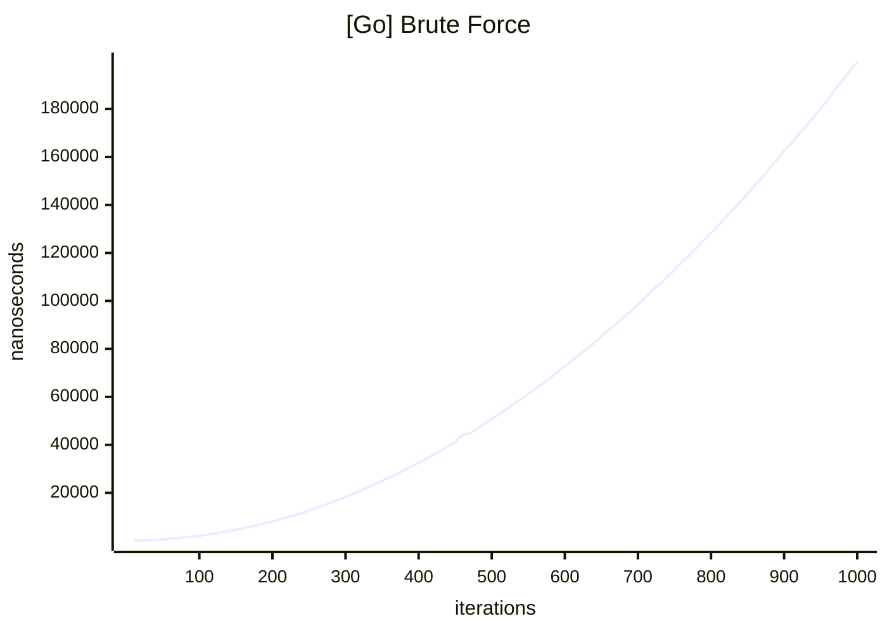
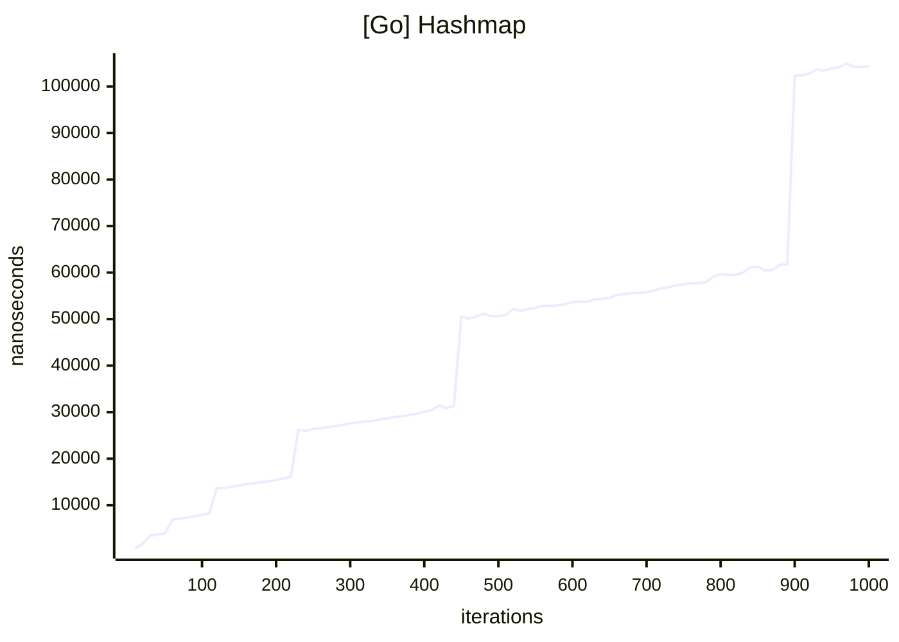
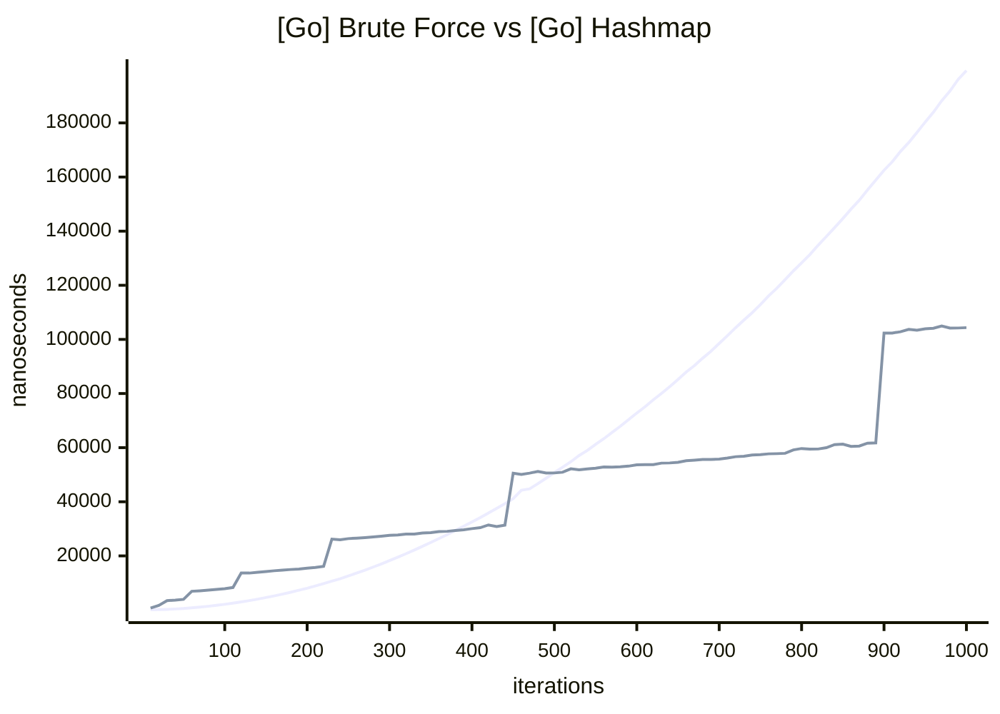
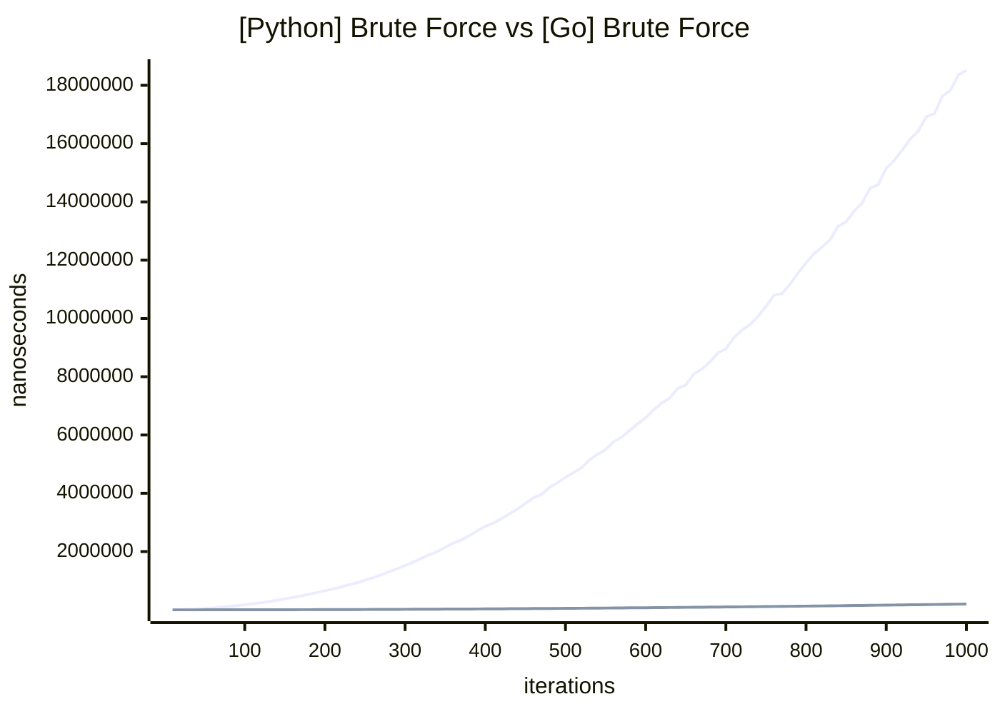
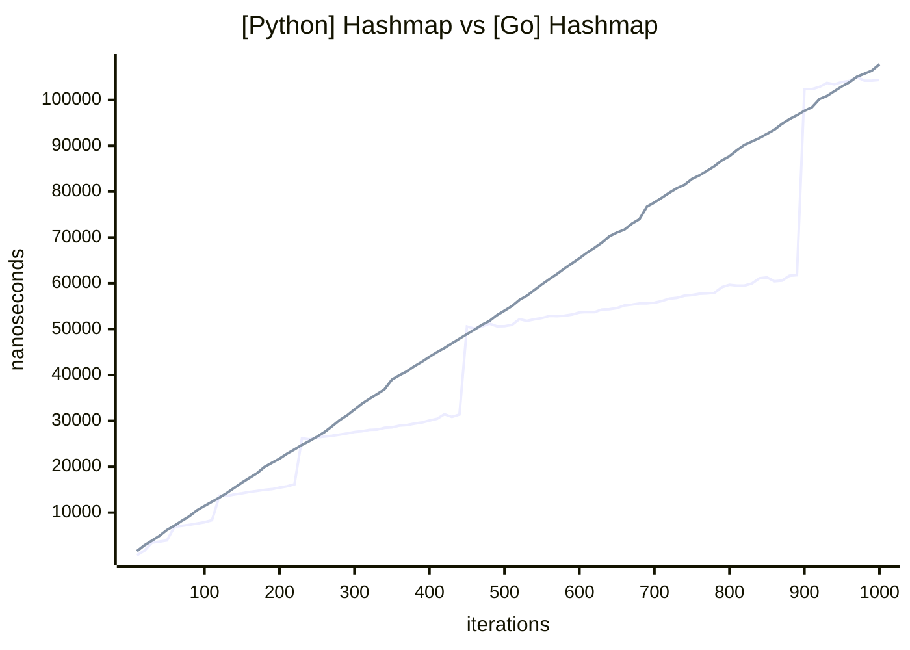
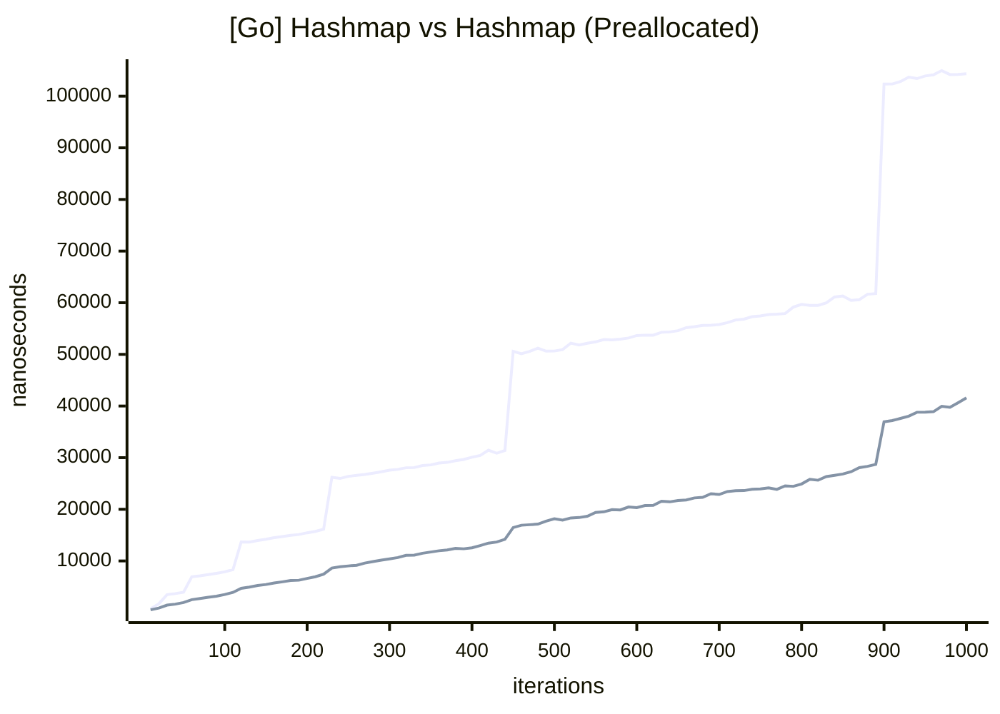
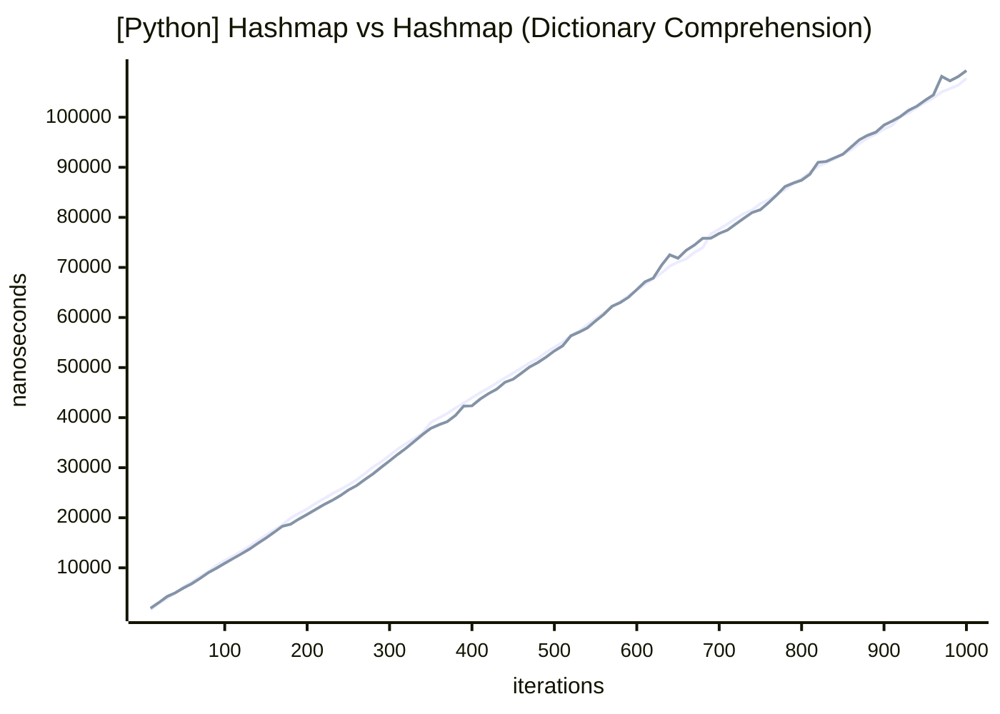
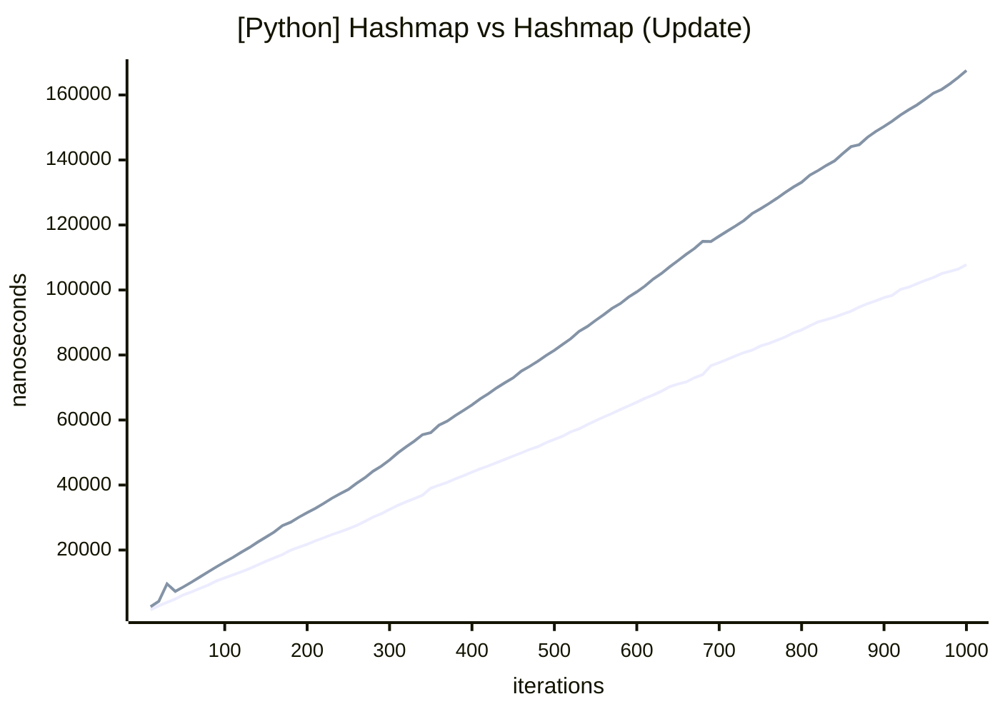
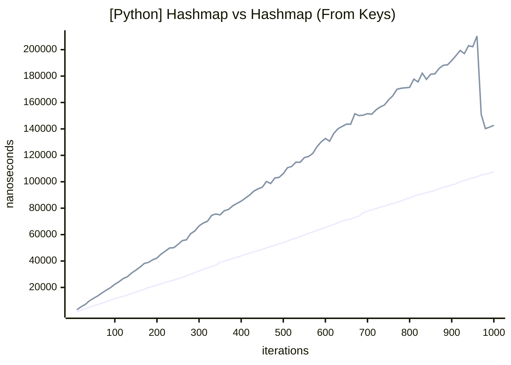

> A deep dive into why real-world performance often defies Big-O expectations and why context and profiling matter more than theoretical complexity
<!--more-->

[](https://mrshiny608.github.io/MrShiny608/feed.xml)  [](https://www.linkedin.com/in/timothybrookes) [](https://github.com/MrShiny608/code_profiling_playground/tree/master)

## How Can We Make This Faster? 🏎️💨

In one of the many interviews I've been doing lately, I found myself staring down a Leetcode-style question. Now, I know these get mixed reactions - some argue you can't possibly assess a developer's true abilities in 30-60 minutes with a couple of function implementations, while others see the value in how a candidate tackles problems, communicates, and collaborates. Personally? I don’t love them, but I do enjoy the excuse to show off some of the deeper magics...🧙‍♂️

The task? The classic "Two Sum" problem. You're given a list of unique numbers and a target. Find the indices of the two numbers that add up to the target. Easy. I quickly typed out the brute-force solution in Go:

```go
// target := int64(8)
// data := []int64{5, 7, 3, 2}

length := int64(len(data))

for i := int64(0); i < length; i++ {
    complement := target - data[i]

    for j := i + 1; j < length; j++ {
        if data[j] == complement {
            return []int64{i, j}
        }
    }
}

return nil
```

"Okay, nice. How can we make this faster?" the interviewer asked.

*I smiled. The room darkened. Overhead lights flickered and dimmed as if a storm had rolled in. My glasses flared with an unnatural white gleam. Purple tendrils of the low-level deep magics curled up from the floor.* 🌩️

"We can't". 😈

## Big-O Notation 📈

The next few minutes were spent discussing Big-O notation. My implementation? `O(n²)`. The classic answer is to improve it to `O(n)` with a hashmap. But I pointed out - Big-O doesn't measure speed, it measures how *performance degrades* as `n` increases.

Here’s what that looks like:

```go
// target := int64(8)
// data := []int64{5, 7, 3, 2}

hashmap := make(map[int64]int64)
for i, a := range data {
    complement := target - a

    index, ok := hashmap[complement]
    if ok {
        return []int64{index, int64(i)}
    }

    hashmap[a] = int64(i)
}

return nil
```

Let me put it this way:

$$
\begin{aligned}
\text{Assume: } &\quad O_1(n) = c_1 \cdot n \\ &\quad O_2(n^2) = c_2 \cdot n^2 \\
\text{At } n = 4: & \\
c_1 \cdot 4 &\leq c_2 \cdot 16 \\
\Rightarrow \frac{c_1}{c_2} &\leq 4 \\
\end{aligned}
$$

That is, with our tiny input of four elements, our `O(n)` implementation can only afford to have the cost of `O` be four times more expensive than our `O(n²)` implementation before it's actually *slower*. And in the case of the hashmap implementation, `O` is *a lot* slower... 🐢

## Memory Access Times 💾

So what makes the hashmap version slower? It's all about allocations and writes. Every time the CPU writes to memory, it checks the L1 cache, then L2, L3, and finally RAM. The further it goes, the slower it gets:

- L1 cache: ~1ns ⚡
- L2: ~5ns ⚙️
- L3: ~10ns 🧲
- RAM: ~100ns 🐌

The hashmap implementation requires writing up to `n` entries, as well as allocating the backing store for them, potentially multiple times dues to resizes. That's a lot of work for a small input.

## Profiling 📊

As with all performance questions, the only way to answer is: measure. If you're not measuring, you're guessing. I wrote a full post on how to do that right over [here](https://mrshiny608.github.io/MrShiny608/optimisation/2025/04/15/ProfilingCodeWithoutGettingTricked).

For all the graphs below, I deliberately set a worst-case scenario: the target is `-1`, and the data is all unique positive numbers, so no early-outs and no duplicate key advantages.

<div class="mermaid-grid">
<div class="xlarge-inline-card">



</div>
</div>

As expected, the brute-force implementation shows a textbook `O(n²)` curve. At `n = 10`, it takes \~63ns.

<div class="mermaid-grid">
<div class="xlarge-inline-card">



</div>
</div>

Now this one’s interesting. 🤔 Ignoring the “steps” for a moment, the general trend is `O(n)` as expected - but at `n = 10` it takes a staggering \~721ns, more than ten times slower than the brute force implementation.

But what are those steps?

They come from bucket allocation. Go’s map implementation starts with an initial bucket size. When it fills up, it grows the map - not by 1, but by a factor. Each resize involves memory allocation *and* copying. That’s expensive. 💸

<div class="mermaid-grid">
<div class="xlarge-inline-card">



</div>
</div>

Overlaying both implementations, it’s clear: below `~n = 370`, brute force is faster. After `~n = 500`, the hashmap version pulls ahead. 🚀

So back to the interview: *the binary of the universe flickering in and out of existence, the fabric of reality loosening like the seams...* 🪐

"No, we can’t make this faster - not for this use case."

## Context Matters 🎯

Sure, Two Sum is simple. But the lesson applies broadly.

Consider these examples:

- **In-match leaderboard** 🏆: Are you really handling 370+ players at once? Highly unlikely - unless you're running an MMO raid boss from hell. Stick with the `O(n²)` brute-force - it’s simpler, and faster where it matters.
- **Global leaderboard** 🌍: Got thousands or millions of players syncing in real-time? Now you're in scalability territory. This is where `O(n)` starts earning its keep.
- **UI hit detection** 🧩: Ten overlapping widgets on a screen? Brute-force is fine. No need to build a spatial index for your todo app.
- **Ray tracing** 🎥: Hundreds of thousands of rays and geometry? That’s when `O(log n)` acceleration structures save your bacon.
- **Fraud detection** 🔒: Comparing hundreds of transactions per user per second? Better optimize that logic path, or your infra bill will find you.
- **AI search trees** ♟️: Got a 3-move lookahead in chess? Brute force might work. But a 20-move tree? Welcome to exponential growth - better bring pruning and heuristics.

The right choice depends on context, and to prove your assumptions requires measurement. Choosing `O(n)` "because it's faster" is the wrong instinct. It’s not faster - it just has a better *rate of performance decay*.

## Is This Always True? 🤷‍♂️

I wanted to test Python too. It’s not a fair fight - Go is a compiled, low-level beast. Python, even on a good day, is an interpreted langauge who takes strolls in the park, watches the ducks, and honours the UK Tea Alarm. 🫖

But I was curious, how would an interpreted language fare? 🧐

```python
# target: int = 8
# data: List[int] = [5, 7, 3, 2]

length = len(data)
for i, a in enumerate(data):
    complement = target - a

    for j in range(i + 1, length):
        if data[j] == complement:
            return [i, j]

return None
```

<div class="mermaid-grid">
<div class="xlarge-inline-card">



</div>
</div>

As expected, Python's brute force is *slow*, starting at \~4041ns for `n = 10`. I tried variations of the loops: `range`, `enumerate`, `while`... didn't matter. Just running the nested loops, without comparisons, cost \~200ns per entry in the dataset.

So lets check out the hashmap...

```python
# target: int = 8
# data: List[int] = [5, 7, 3, 2]

hashmap = {}
for i, a in enumerate(data):
    complement = target - a

    if complement in hashmap:
        return [hashmap[complement], i]

    hashmap[a] = i

return None
```

<div class="mermaid-grid">
<div class="xlarge-inline-card">



</div>
</div>

Wait... what? 😳

*Python materializes beside me in the interview room - cloaked in swirling purple vapour, its presence bending the rules of logic and* - okay okay, enough with the dramatisation! 🧙‍♂️

Erm, yes, so, beating all expectations Python has not only achieved performance *on par with Go* but it's also avoided the stepped allocations, at `n = 10` Python took \~1604ns! I checked out some PEPs and the CPython dictionary [source code](https://github.com/python/cpython/blob/main/Objects/dictobject.c), here’s what’s going on:

- `complement in hashmap` and `hashmap[a] = i` are backed by C implementations, these operations don’t stay in Python - they cross the boundary into optimized C code, skipping the interpreter’s overhead entirely. That boundary crossing is expensive in general, but once through, you get raw performance with near-native memory access speeds. 🚀
- Writes to dict are mostly memory-bound - and Python’s bottleneck *is* the CPU. While waiting for those memory accesses to complete, the CPU doesn’t just sit idle. It stays busy interpreting Python bytecode, handling reference counting, checking types, and managing control flow.

Combined, these mean Python is able to perform ridiculously fast, and time it's allocations to fit better within CPU utilisation. If you squint hard, you *can* spot micro-steps, but they're faint. The interpreted nature of Python smooths the curve. 🌊

## So what's the real takeaway? 🎓

Big-O isn't about speed - it's about rate of decay. Profiling beats speculation every time. Complexity tells you *how bad things might get*, but not *when*. That line? You won’t find it on a whiteboard - you find it on a profiler.

- ✅ Measure first. Think later.
- ✅ Choose algorithms based on *real-world contexts*, not theoretical elegance.
- ✅ And maybe cut Python some slack, occasionally it vastly outperforms expectations.

## Closing Notes🧾

### Preallocating Go 🏗️

In Go, we can preallocate enough memory for our hashmap right from the start, eliminating the need for incremental resizes during insertion:

```go
hashmap := make(map[int64]int64, len(data))
```

The rest of the code stays exactly the same. The result? The allocation "steps" become smaller and smoother. There’s still an upfront allocation cost, but now it happens once - early and predictably, which is why we still get steps, but they are much smaller. ✨

The reason I didn't include this in the above is because it added complexity to the post and this post isn't about Go vs Python, it is about `O(n)` vs `O(n²)`

<div class="mermaid-grid">
<div class="xlarge-inline-card">



</div>
</div>

### Preallocating Python 🐍

As we've seen, choosing the Right Tool For The Job™ 🛠️ can help Python perform significantly better than expected, and preallocating in Go demonstrated a clear performance boost. So, what similar options does Python offer? Unfortunately, after testing dictionary comprehensions and the dictionary `update` and `from_keys` methods, none exhibited behavior resembling preallocation. I even tried caching the `hashmap` dictionary and clearing it out before each call to the two sum function, but it behaved as if `clear` also released the memory, so this didn't help either.

My recommendation here would be to lean towards dictionary comprehensions for pre-populating hashmaps. They showed no adverse impact on performance and offer a clear, idiomatic path that Python developers may further optimise in the future - much like the enhancements made to higher-order functional built-ins such as map, filter, and reduce in the V8 JavaScript engine.

#### Preallocation With Dictionary Comprehension

```python
hashmap = {v: i for i, v in enumerate(data)}

for i, a in enumerate(data):
    complement = target - a

    if complement in hashmap:
        return [hashmap[complement], i]

return None
```

<div class="mermaid-grid">
<div class="xlarge-inline-card">



</div>
</div>

As we see there is no significant performance difference, nor is the dictionary comprehension consistently faster.

#### Preallocation With Update

```python
hashmap = {}
hashmap.update(enumerate_to_dict_update(data))

for i, a in enumerate(data):
    complement = target - a

    if complement in hashmap:
        return [hashmap[complement], i]

return None
```

In this case we have to build a custom generator to convert `enumerate` to the correct form for `update`

```python
def enumerate_to_dict_update(data: List[int]) -> Generator[Tuple[int, int], None, None]:
    for i, a in enumerate(data):
        yield a, i
```

<div class="mermaid-grid">
<div class="xlarge-inline-card">



</div>
</div>

Here we see that `update` is slower than using our original implementation, which is a surprise as at the most it should be doing the same work...

#### Preallocation With From Keys

```python
hashmap = dict.fromkeys(data)

for i, a in enumerate(data):
    complement = target - a

    j = hashmap.get(complement)
    if j is not None:
        return [j, i]

    hashmap[a] = i

return None
```

<div class="mermaid-grid">
<div class="xlarge-inline-card">



</div>
</div>

Here we see that `from_keys` is also slower than our original implementation, even including the dramatic reduction around a data size of 1000

---

[](https://mrshiny608.github.io/MrShiny608/feed.xml)  [](https://www.linkedin.com/in/timothybrookes) [](https://github.com/MrShiny608/code_profiling_playground/tree/master)
